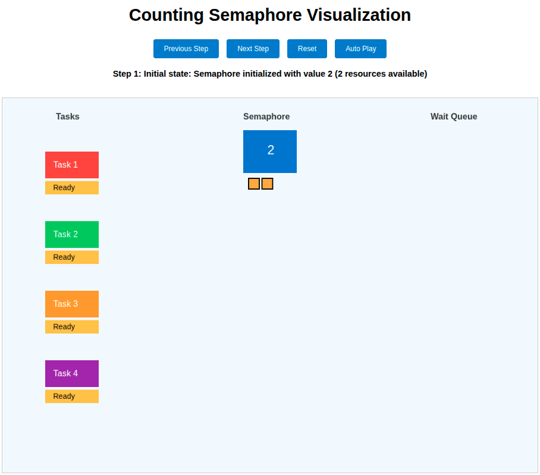

# Lesson 4: Task Syncronization and Using Semaphores

## 🧵 Mutex vs Semaphore (Binary & Counting)

### 📘 Definitions

#### 🔐 Mutex
- A **mutual exclusion** lock.
- Only **one thread** can enter the critical section.
- Enforces **ownership**: only the thread that locks it can unlock it.

#### 🚦 Binary Semaphore
- A semaphore with only **two states**: 0 or 1.
- Allows **one thread** at a time into the critical section.
- **No ownership**: any thread can signal (post).

#### 🧮 Counting Semaphore
- Semaphore with an initial value > 1.
- Allows up to **N threads** to access a shared resource.
- Commonly used for **limiting concurrent access**.

---

## ❓ Mutex vs Binary Semaphore

Although mutexes and binary semaphores seem similar because both allow only one thread to access a resource at a time, they work differently and are used in different situations. A mutex is owned by the thread that locks it, and only that thread can unlock it. On the other hand, a binary semaphore doesn’t have ownership, so any thread can signal (release) it. This difference affects how they are used in managing access to shared resources.

| Feature              | 🔐 Mutex                  | 🚦 Binary Semaphore           |
|----------------------|---------------------------|-------------------------------|
| Ownership enforced   | ✅ Yes                    | ❌ No                         |
| Used for locking     | ✅ Yes                    | ✅ Yes                        |
| Used for signaling   | ❌ No                     | ✅ Yes                        |
| Unlock/signal by     | Same thread only          | Any thread                   |
| Cross-process usage  | ❌ Not ideal              | ✅ Supported (named semaphores) |
| Risk of misuse       | Low                       | Higher                       |



---

## 🏪 Shared Room Analogy

Imagine a **shared meeting room**, and multiple people (threads) want to use it.  
Below are the solutions using **mutex** and **binary semaphore**:

---

### 🔐 Mutex — Room with a Personal Key
- Only one **key** exists.
- A person (thread) takes the key and **locks** the room.
- Only **they** can unlock it and leave.
- No one else can unlock the room, even if it's empty.

**Traits:**
- Enforces exclusive access.
- Enforces ownership (strict).
- Safer, but less flexible (no external signals).

---

### 🚦 Binary Semaphore — Room with a Light Switch
- A **light outside** shows room status:  
  - **Green** = free  
  - **Red** = occupied
- Anyone can enter if light is green, then **flip it to red**.
- When leaving, **anyone** can flip it back to green.

**Traits:**
- Allows one person at a time.
- No ownership — anyone can signal.
- Suitable for signaling between people (threads).
- Misuse possible if someone flips the light at the wrong time.

---

### 🧮 Counting Semaphore — Parking Lot with N Spaces
- A **parking lot** with **N spots**.
- Each person (thread) parks in a spot.
- When all spots are full, others must wait.
- Leaving a spot frees it for someone else.

**Traits:**
- Allows up to N concurrent users.
- No ownership — any car can leave.
- Great for resource-limiting (e.g. thread pool, DB connections).

---

## ⚖️ Scenario Comparison

| Scenario                                 | 🔐 Mutex (Key)           | 🚦 Binary Semaphore (Light) | 🧮 Counting Semaphore (Parking Lot) |
|------------------------------------------|---------------------------|------------------------------|--------------------------------------|
| Description of the scenario              | 🔐🚪 A door, a lock and a key | 🚦🚪 A door, light signal | 🚧🚗 Parking lot and multiple cars    |
| One person at a time                     | ✅ Enforced by personal key | ✅ Enforced by light switch    | ❌ Allows multiple people            |
| Signaling from another person/thread     | ❌ Not allowed              | ✅ Anyone can flip light       | ✅ Anyone can free a spot            |
| Safety & misuse prevention               | ✅ Very safe                | ❌ Risky if misused            | ❌ Risky if count mismanaged         |
| Signaling between threads                | ❌ Not suitable             | ✅ Ideal                      | ✅ Ideal                             |
| Cross-process support                    | ❌ Not ideal                | ✅ Supported                  | ✅ Supported                         |
| Ownership enforced                       | ✅ Yes                     | ❌ No                         | ❌ No                                |
| Lightweight                              | ✅ Yes                     | ❌ Slightly heavier           | ❌ Heavier                          |

---

## Learning Objectives

By the end of this lesson, you will:

1. Understand the difference between mutexes and semaphores
2. Learn how to use binary semaphores to solve race conditions
3. Explore task signaling with binary semaphores
4. Implement resource management with counting semaphores

---

## 1. Solving Race Conditions with Binary Semaphores

In the previous lesson, we fixed a race condition using a mutex to safely increment a shared variable. In this example, we'll achieve the same result, but with a binary semaphore instead.

### From `Solution_Race_Condition_Demo_Using_Binary_Semaphore.ino`:

```cpp
// Global variables
static int shared_var = 0;           // Our shared value
SemaphoreHandle_t bin_sem;           // Binary semaphore

// Create binary semaphore
bin_sem = xSemaphoreCreateBinary();

// Make sure it was created successfully
if (bin_sem == NULL) {
  Serial.println("Failed to create semaphore.");
  while (1);  // Hang if we can't create semaphore
}

// Give the semaphore initially so it can be taken
xSemaphoreGive(bin_sem);
```

The critical section is protected similarly to a mutex:

```cpp
// --- CRITICAL SECTION START ---
// Wait (take) the binary semaphore before accessing shared_var
if (xSemaphoreTake(bin_sem, portMAX_DELAY) == pdTRUE) {
  // Read shared value (critical section)
  local_var = shared_var;
  
  // Fake work (makes race condition more likely)     
  vTaskDelay(random(100, 500) / portTICK_PERIOD_MS);
  
  // Modify value      
  local_var++;
  
  // Write back to shared variable      
  shared_var = local_var;

  // Release the semaphore
  xSemaphoreGive(bin_sem);
}
// --- CRITICAL SECTION END ---
```

**Important Note**: Unlike mutexes, this binary semaphore must be initialized with `xSemaphoreGive()` before first use, since semaphores start in the "taken" state.

## 2. Task Synchronization with Binary Semaphores

Binary semaphores are ideal for signaling between tasks. In this example (`Binary_Semaphores.ino`), we have:
- A "trigger" task that signals another task every 3 seconds
- A "responder" task that waits for the signal and then blinks an LED

### From `Binary_Semaphores`:

Creating the binary semaphore:
```cpp
// Create a binary semaphore
syncSemaphore = xSemaphoreCreateBinary();
```

The trigger task signals by giving the semaphore:
```cpp 
void triggerTask(void *pvParameters) {
  for(;;) {
    // Wait for 3 seconds
    Serial.printf("Trigger [Core %d]: Waiting 3 seconds...\n", core);
    vTaskDelay(3000 / portTICK_PERIOD_MS);
    
    // Signal the responder task by giving the semaphore
    Serial.printf("Trigger [Core %d]: Signaling responder task\n", core);
    xSemaphoreGive(syncSemaphore);
  }
}
```

The responder task waits indefinitely for the signal:
```cpp
void responderTask(void *pvParameters) {
  for(;;) {
    // Wait indefinitely for the semaphore
    Serial.printf("Responder [Core %d]: Waiting for signal...\n", core);
    if(xSemaphoreTake(syncSemaphore, portMAX_DELAY) == pdTRUE) {
      // Semaphore obtained, blink the LED
      Serial.printf("Responder [Core %d]: Signal received! Blinking LED\n", core);
      
      // Blink LED 5 times quickly
      // ...blink code here...
    }
  }
}
```

**Result:** The LED blinks in bursts of 5 quick flashes every 3 seconds, showing perfect synchronization between tasks on different cores.

## 3. Resource Management with Counting Semaphores

Counting semaphores allow multiple tasks to access a limited resource pool. In `Counting_Semaphores.ino`, we simulate:
- A resource pool with 2 slots
- 3 worker tasks competing for these resources

### From `Counter_Semaphores`:

First, the program creates the necessary semaphores:

```cpp
// Semaphore handles  
SemaphoreHandle_t poolSem = NULL;
SemaphoreHandle_t serialMutex = NULL;

void setup() {
  Serial.begin(115200);
  pinMode(LED_PIN, OUTPUT);
  digitalWrite(LED_PIN, LOW);

  // Create semaphores
  poolSem = xSemaphoreCreateCounting(2, 2);  // maxCount = 2, initialCount = 2
  serialMutex = xSemaphoreCreateMutex();
  
  // Error checking and task creation...
}
```

Here we see:
- A counting semaphore (`poolSem`) for the resource pool with maximum and initial count of 2
- A mutex (`serialMutex`) to ensure Serial output is properly synchronized

### Worker Task Implementation

```cpp
// Worker task
void worker(void* pvParameters) {
  int id = (int)pvParameters;

  for (;;) {
    int available = uxSemaphoreGetCount(poolSem);
    char statusMsg[50];
    snprintf(statusMsg, sizeof(statusMsg), "Waiting… Pool Available = %d\n", available);
    logMessage(id, "WAIT", statusMsg);
    
    // Try acquiring resource
    xSemaphoreTake(poolSem, portMAX_DELAY);
    logMessage(id, "ACQUIRE", "Slot acquired. Blinking LED twice\n");

    // Simulate work (2 LED blinks)
    for (int i = 0; i < 2; ++i) {
      digitalWrite(LED_PIN, HIGH);
      vTaskDelay(pdMS_TO_TICKS(150));
      digitalWrite(LED_PIN, LOW);
      vTaskDelay(pdMS_TO_TICKS(150));
    }

    logMessage(id, "RELEASE", "Work done. Releasing slot\n");
    xSemaphoreGive(poolSem);
    
    char waitMsg[40];
    snprintf(waitMsg, sizeof(waitMsg), "Sleeping for %d sec before next round\n\n", id);
    logMessage(id, "SLEEP", waitMsg);
    
    // Wait before next attempt
    vTaskDelay(pdMS_TO_TICKS(1000 * id));
  }
}
```

Here's what each part of the worker task does:

#### 1. Task Identification and Resource Status
```cpp
int id = (int)pvParameters;
int available = uxSemaphoreGetCount(poolSem);
char statusMsg[50];
snprintf(statusMsg, sizeof(statusMsg), "Waiting… Pool Available = %d\n", available);
logMessage(id, "WAIT", statusMsg);
```
- Each worker gets an ID passed as a parameter
- `uxSemaphoreGetCount(poolSem)` checks and reports how many resources are currently available
- The worker logs this information with a formatted message

#### 2. Resource Acquisition
```cpp
// Try acquiring resource
xSemaphoreTake(poolSem, portMAX_DELAY);
logMessage(id, "ACQUIRE", "Slot acquired. Blinking LED twice\n");
```
- Attempts to take one resource from the pool
- If no resources are available (count is 0), the task waits indefinitely (`portMAX_DELAY`)
- When the semaphore count is greater than 0, the task can proceed and the count is decremented
- The task logs successful acquisition

#### 3. Work Simulation
```cpp
// Simulate work (2 LED blinks)
for (int i = 0; i < 2; ++i) {
  digitalWrite(LED_PIN, HIGH);
  vTaskDelay(pdMS_TO_TICKS(150));
  digitalWrite(LED_PIN, LOW);
  vTaskDelay(pdMS_TO_TICKS(150));
}
```
- The worker simulates doing work by blinking the onboard LED twice
- This represents the time the worker holds the resource

#### 4. Resource Release
```cpp
logMessage(id, "RELEASE", "Work done. Releasing slot\n");
xSemaphoreGive(poolSem);
```
- Returns the resource to the pool when the work is completed
- This increments the semaphore count, allowing another waiting task to acquire the resource

#### 5. Delay Before Next Attempt
```cpp
char waitMsg[40];
snprintf(waitMsg, sizeof(waitMsg), "Sleeping for %d sec before next round\n\n", id);
logMessage(id, "SLEEP", waitMsg);
vTaskDelay(pdMS_TO_TICKS(1000 * id));
```
- Worker logs that it's going to sleep
- Makes each worker wait a different amount of time before trying to acquire the resource again
- The delay is proportional to the worker's ID (e.g., worker 1 waits 1 second, worker 2 waits 2 seconds)
- This creates a staggered pattern of resource requests

### Task Creation

The example creates 3 worker tasks that will compete for the 2 available resources:

```cpp
void setup() {
  // ... setup code ...

  // Launch 3 worker tasks
  xTaskCreatePinnedToCore(
    worker,               // Task function 
    "Worker 1",           // Task name
    2048,                 // Stack size (bytes) 
    (void*)1,             // Task parameter (worker number) 
    1,                    // Priority (1 is low) 
    NULL,                 // Task handle 
    0                     // Run on Core 0
    );
  
  xTaskCreatePinnedToCore(
    worker, 
    "Worker 2", 
    2048, 
    (void*)2, 
    1, 
    NULL, 
    1                     // Run on Core 1 
    );
  
  xTaskCreatePinnedToCore(
    worker, 
    "Worker 3", 
    2048, 
    (void*)3, 
    1, 
    NULL, 
    1                     // Run on Core 1
    );
}
```

This creates:
- Worker 1 on Core 0 with ID 1
- Worker 2 on Core 1 with ID 2
- Worker 3 on Core 1 with ID 3

### Synchronizing Serial Output

The example also uses a mutex to ensure that serial output from multiple tasks doesn't get interleaved:

```cpp
// Aligned logger
void logMessage(int id, const char* stage, const char* msg) {
  
  if (xSemaphoreTake(serialMutex, pdMS_TO_TICKS(100))) {
    // Print aligned table row: Worker | Stage     | Message
    Serial.printf("[W%-2d] | %-9s | %s\n", id, stage, msg);
    xSemaphoreGive(serialMutex);
  }
}
```

This helper function:
- Takes a mutex before accessing the serial port
- Uses a timeout of 100ms (if it can't get the mutex in that time, it skips logging)
- Formats output in an aligned table format
- Releases the mutex when done

### Expected Console Output

The program produces a table-formatted output showing the state transitions:

```
=== Counting Semaphore Demo (2 Slots) ===
FORMAT: [Worker] | [Stage]    | [Message]
---------------------------------------------------
[W1 ] | WAIT      | Waiting… Pool Available = 2
[W3 ] | WAIT      | Waiting… Pool Available = 2
[W2 ] | WAIT      | Waiting… Pool Available = 2
[W1 ] | ACQUIRE   | Slot acquired. Blinking LED twice
[W3 ] | ACQUIRE   | Slot acquired. Blinking LED twice
[W2 ] | WAIT      | Waiting… Pool Available = 0
[W1 ] | RELEASE   | Work done. Releasing slot
[W1 ] | SLEEP     | Sleeping for 1 sec before next round

[W2 ] | ACQUIRE   | Slot acquired. Blinking LED twice
[W3 ] | RELEASE   | Work done. Releasing slot
[W3 ] | SLEEP     | Sleeping for 3 sec before next round

[W2 ] | RELEASE   | Work done. Releasing slot
[W2 ] | SLEEP     | Sleeping for 2 sec before next round

[W1 ] | WAIT      | Waiting… Pool Available = 2
```

This illustrates:
1. The system starts with 2 available resources in the pool
2. All 3 workers start and attempt to acquire a resource:
   - 2 workers (1 and 3) can proceed immediately (acquiring the 2 available resources)
   - Worker 2 must wait until one of the active workers releases its resource
3. As workers complete their tasks and release resources, the waiting worker(s) can proceed
4. The staggered delays create a dynamic pattern of resource allocation and release

---

### Visualization

Even with detailed serial output, understanding the process flow of a counting semaphore can sometimes be challenging. The counting_semaphore_visualization.html file provides a simple, interactive way to visualize how a counting semaphore works. It simulates a scenario with a pool of 2 resources managing 4 tasks. To use it, simply open the file in any web browser and step through the process using the provided control buttons. You will find the following UI:



## Key Points

- **Binary Semaphores** can be used both for:
  - Mutual exclusion (like a mutex, but without ownership)
  - Signaling between tasks

- **Counting Semaphores** are ideal for:
  - Managing pools of limited resources
  - Tracking event counts
  - Limiting concurrent access to multiple instances of a resource

- **When to use each:**
  - Use **Mutexes** when you need strict ownership (only the locker can unlock)
  - Use **Binary Semaphores** for simple signaling between tasks
  - Use **Counting Semaphores** when multiple tasks need simultaneous access to a limited resource pool
