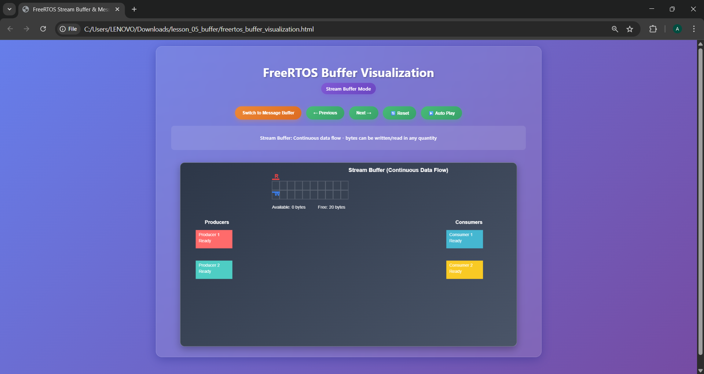
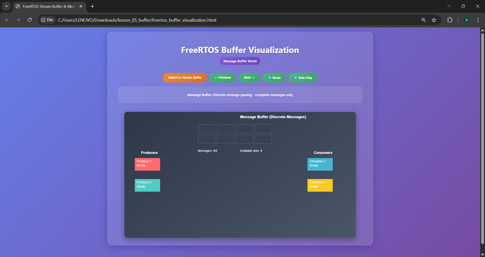

# ESP32 RTOS Lesson 5: Understanding Message Buffers & Stream Buffers

## 📚 Prerequisites

To follow this lesson, you should have:
- Basic knowledge of Arduino programming (e.g., `Serial.begin`, `pinMode`).
- Familiarity with FreeRTOS tasks and delays (covered in previous lessons).
- An ESP32 development board (e.g., ESP32 DevKitC) with GPIO 2 (LED) and GPIO 4 (touch pin T0).
- Arduino IDE with the ESP32 board package installed.

For setup instructions, visit: [ESP32 Arduino Setup Guide](https://docs.espressif.com/projects/arduino-esp32/en/latest/installing.html).

## 📨 Message Buffers vs Stream Buffers vs Queues

### 📘 Definitions

#### 📮 Message Buffers
- **Variable-length message passing** between tasks.
- Each message is **discrete** and **complete**.
- Messages can be of **different sizes**.
- **FIFO ordering** (First In, First Out).
- **Zero-copy** implementation for efficiency.

#### 🌊 Stream Buffers
- **Continuous data streaming** between tasks.
- Data is treated as a **byte stream**.
- **No message boundaries** - data flows continuously.
- Ideal for **sensors or high-throughput data**.
- **Circular buffer** implementation.
- Visualized in [freertos_buffer_visualization.html](freertos_buffer_visualization.html) for interactive demonstration.

#### 📦 Queues (Previous Lesson Reference)
- **Fixed-size items** only.
- Each item has the **same size**.
- **Structured data** passing.
- **Copy-based** implementation.

---

## ❓ When to Use Each?

| Feature                    | 📮 Message Buffers        | 🌊 Stream Buffers         | 📦 Queues               |
|----------------------------|---------------------------|---------------------------|-------------------------|
| Message size               | Variable (0-65535 bytes)  | Continuous stream         | Fixed size only         |
| Data boundaries            | ✅ Preserved              | ❌ No boundaries          | ✅ Preserved            |
| Zero-copy efficiency       | ✅ Yes                    | ✅ Yes                    | ❌ No (copies data)     |
| Memory usage               | Efficient for large data  | Very efficient            | Higher overhead         |
| Use case                   | Commands, packets         | Sensors, streaming        | Small structured data   |
| Typical data size          | Large & variable          | Continuous streams        | Small & fixed           |

---

## 🏭 Factory Analogy

Imagine three different **communication systems** in a factory:

---

### 📮 Message Buffers — Package Delivery System
- Workers send **complete packages** of different sizes.
- Each package contains a **complete order** (small envelope or large box).
- Packages arrive **intact** and in **order**.
- Recipient gets the **entire package** at once.
- **Zero waste** - no packaging material is copied.

**Traits:**
- Variable-size messages.
- Complete, discrete units.
- Efficient for large data.
- Perfect message boundaries.

---

### 🌊 Stream Buffers — Conveyor Belt
- **Continuous flow** of items on a belt.
- Items **merge together** - no individual packaging.
- Workers can **take what they need** when ready.
- **Steady flow** rather than discrete packages.
- Very **efficient** - minimal overhead.
- See [freertos_buffer_visualization.html](freertos_buffer_visualization.html) for a visual representation.

**Traits:**
- Continuous data flow.
- No message boundaries.
- Streaming applications.
- High throughput.

---

### 📦 Queues — Uniform Storage Boxes
- All items must fit in **identical boxes**.
- Each box is **copied** when transferred.
- **Structured** and **predictable**.
- Good for **small, uniform** items.
- Higher **storage overhead**.

**Traits:**
- Fixed-size items only.
- Structured data.
- Copy-based (safe but slower).
- Good for control messages.

---

## 🌍 Real-World Applications

Understanding where to apply message buffers, stream buffers, and queues in real-world projects helps you choose the right tool for your application. Below are practical examples of where each is commonly used:

### 📮 Message Buffers
- **IoT Device Configuration**: Sending JSON or XML configuration packets to an IoT device, where each packet varies in size but must be received intact (e.g., updating settings on a smart thermostat).
- **Network Protocols**: Transmitting network packets (e.g., MQTT or HTTP messages) where each message is a complete unit with variable length.
- **Command Processing**: Sending commands to a robot (e.g., "move forward 10cm", "turn left") where commands differ in length but need clear boundaries.
- **Example in this Lesson**: The touch duration logger (`message_buffer_practical.ino`) sends complete messages about touch event durations, like "Touch duration: 500 ms".

### 🌊 Stream Buffers
- **Sensor Data Streaming**: Continuously streaming sensor data, such as temperature, accelerometer, or microphone readings, where data is a steady flow without distinct boundaries (e.g., real-time monitoring in a weather station).
- **UART/SPI Communication**: Streaming serial data from a GPS module or other peripherals to the ESP32, where high throughput is critical.
- **Audio Processing**: Streaming audio samples for real-time playback or analysis, such as in a voice-activated device.
- **Example in this Lesson**: The touch intensity streamer (`stream_buffer_practical.ino`) streams touch sensor values during a touch event, enabling real-time LED control.

### 📦 Queues
- **Task Synchronization**: Sending small, fixed-size control messages between tasks, such as triggering a state change in a state machine (e.g., "start", "stop", "pause").
- **Event Handling**: Queuing button press events or interrupts in a home automation system, where each event is a fixed-size structure (e.g., `{event_type, timestamp}`).
- **Resource Management**: Coordinating access to shared resources, like sending motor control signals in a robotic arm with fixed-size commands.
- **Example in Previous Lessons**: Queues are used for small, structured data like status flags or sensor thresholds.

---

## Learning Objectives

By the end of this lesson, you will:

1. Understand the differences between message buffers, stream buffers, and queues.
2. Learn how to use message buffers for variable-length data communication.
3. Implement stream buffers for continuous data streaming.
4. Choose the right buffer type for different applications.
5. Build practical examples with sensor data and LED control.
6. Visualize buffer operations using [freertos_buffer_visualization.html](freertos_buffer_visualization.html).

---

## 1. Message Buffers: Variable-Length Communication

Message buffers excel at sending complete messages of different sizes between tasks. Let's explore both a demo and a practical example.

### Demo Example: Message Buffer Demo

The script `message_buffer_demo.ino` demonstrates sending variable-length strings from a sender task to a receiver task using a message buffer.

- **Creating the Message Buffer:**
  ```cpp
  msgBuffer = xMessageBufferCreate(MESSAGE_BUFFER_SIZE);
  ```

- **Sender Task:**
  - Sends messages of varying lengths:
    ```cpp
    xMessageBufferSend(msgBuffer, message, messageLen, pdMS_TO_TICKS(100));
    ```

- **Receiver Task:**
  - Receives messages:
    ```cpp
    xMessageBufferReceive(msgBuffer, buffer, sizeof(buffer) - 1, portMAX_DELAY);
    ```

**How It Works:**
- The sender task cycles through a set of predefined messages (e.g., "Short", "Medium length", "This is a longer message...") and sends them to the message buffer every second.
- The receiver task reads these messages and logs them to the Serial monitor, showcasing how message buffers preserve message boundaries and handle variable lengths efficiently.


### Practical Example: Touch Duration Logger

In `message_buffer_practical.ino`, a capacitive touch sensor detects touch events, and the sender task sends the touch duration via a message buffer. The receiver task sends the duration to Serial and blinks an LED based on the duration.

- **Creating the Message Buffer:**
  ```cpp
  touchBuffer = xMessageBufferCreate(MESSAGE_BUFFER_SIZE);
  ```

- **Sender Task (touchSenderTask):**
  - Calculates touch duration and sends it:
    ```cpp
    xMessageBufferSend(touchBuffer, message, strlen(message), pdMS_TO_TICKS(100));
    ```

- **Receiver Task (receiverTask):**
  - Receives and processes messages:
    ```cpp
    xMessageBufferReceive(touchBuffer, buffer, sizeof(buffer) - 1, portMAX_DELAY);
    ```

**How It Works:**
- The sender task monitors the touch sensor (GPIO 4). When a touch is detected (value below threshold), it records the start time. When the touch ends, it calculates the duration and sends a message like "Touch duration: 500 ms".
- The receiver task reads the message, extracts the duration, and blinks the LED (GPIO 2) a number of times proportional to the duration (e.g., one blink per 100ms, capped at 5).

**Note:** If the touch sensor doesn't respond, calibrate the `TOUCH_THRESHOLD` (default: 40) by printing `touchRead(T0)` values to Serial and adjusting based on your board's baseline.


---

## 2. Stream Buffers: Continuous Data Flow

Stream buffers are ideal for continuous data streaming without message boundaries. Let's examine a demo and a practical example.

### Demo Example: Stream Buffer Demo

The script `stream_buffer_demo.ino` shows streaming simulated sensor data (incrementing 16-bit values) using a stream buffer.

- **Creating the Stream Buffer:**
  ```cpp
  streamBuffer = xStreamBufferCreate(STREAM_BUFFER_SIZE, TRIGGER_LEVEL);
  ```

- **Sender Task:**
  - Streams incrementing values:
    ```cpp
    xStreamBufferSend(streamBuffer, &sensorValue, sizeof(sensorValue), pdMS_TO_TICKS(100));
    ```

- **Receiver Task:**
  - Receives streamed data:
    ```cpp
    xStreamBufferReceive(streamBuffer, &receivedValue, sizeof(receivedValue), portMAX_DELAY);
    ```

**How It Works:**
- The sender task generates incrementing values (0 to 999) and sends them to the stream buffer every 100ms.
- The receiver task continuously reads these values and logs them to the Serial monitor, illustrating the continuous flow of data.


### Practical Example: Touch Intensity Streamer

In `stream_buffer_practical.ino`, touch intensity values are streamed via a stream buffer during a touch event, and the receiver task toggles an LED based on intensity.

- **Creating the Stream Buffer:**
  ```cpp
  touchStreamBuffer = xStreamBufferCreate(STREAM_BUFFER_SIZE, TRIGGER_LEVEL);
  ```

- **Sender Task (touchSenderTask):**
  - Streams touch values:
    ```cpp
    xStreamBufferSend(touchStreamBuffer, &touchValue, sizeof(touchValue), pdMS_TO_TICKS(10));
    ```

- **Receiver Task (receiverTask):**
  - Receives and processes values:
    ```cpp
    xStreamBufferReceive(touchStreamBuffer, &touchValue, sizeof(touchValue), portMAX_DELAY);
    ```

**How It Works:**
- The sender task monitors the touch sensor (GPIO 4). When a touch is detected, it streams 16-bit touch readings every 20ms (50Hz) until the touch ends.
- The receiver task reads these values in real-time and toggles the LED (GPIO 2) on if the intensity is below a threshold (strong touch) and off otherwise, demonstrating real-time data processing.

**Note:** Adjust `TOUCH_THRESHOLD` (default: 40) and `LED_TOUCH_THRESHOLD` (default: 30) if the LED or touch detection is inconsistent, using Serial output to find appropriate values.


---

## 3. Visualizing Buffer Operations

The `freertos_buffer_visualization.html` file provides an interactive visualization of buffer operations:
- **Stream Buffer Mode**: Shows continuous data flow, like a conveyor belt.
- **Message Buffer Mode**: Shows discrete messages, like packages.

Try switching between modes to see the difference in data handling.




---

## 4. Best Practices and Guidelines

### Choosing the Right Buffer Type
- **Message Buffers**: Use for discrete, variable-length messages (e.g., touch duration in `message_buffer_practical.ino`).
- **Stream Buffers**: Use for continuous data streams (e.g., touch intensity in `stream_buffer_practical.ino`).
- **Queues**: Use for small, fixed-size control messages (covered in previous lessons).

### Memory Management Tips
- Set `MESSAGE_BUFFER_SIZE` (default: 128) or `STREAM_BUFFER_SIZE` (default: 256) to accommodate the largest expected data.
- Use a `TRIGGER_LEVEL` (default: 4) in stream buffers to balance responsiveness and efficiency.
- Monitor Serial output for "Failed to send" errors, indicating a full buffer, and increase buffer size if needed.

### Error Handling Best Practices
- Check buffer creation (`xMessageBufferCreate`, `xStreamBufferCreate`) and halt if it fails.
- Verify send operations (`xMessageBufferSend`, `xStreamBufferSend`) and log failures to Serial.
- Use timeouts (e.g., 100ms for sending) to prevent tasks from hanging indefinitely.

---

## Key Points Summary

### **Message Buffers** 📮
- **Best for**: Variable-length discrete messages (commands, packets).
- **Key advantage**: Zero-copy efficiency with complete message boundaries.
- **Memory**: Efficient for large, variable-sized data.
- **Use when**: You need complete, discrete messages of different sizes.
- **Practical Example**: Touch Duration Logger (`message_buffer_practical.ino`).
- **Real-World Use**: Sending configuration packets or commands in IoT systems.

### **Stream Buffers** 🌊
- **Best for**: Continuous data streaming (sensors, high-throughput data).
- **Key advantage**: Highest throughput with minimal overhead.
- **Memory**: Circular buffer, very efficient.
- **Use when**: Data flows continuously without discrete boundaries.
- **Visualization**: Explore stream buffer behavior in [freertos_buffer_visualization.html](freertos_buffer_visualization.html).
- **Practical Example**: Touch Intensity Streamer (`stream_buffer_practical.ino`).
- **Real-World Use**: Streaming sensor or audio data in real-time applications.

### **Queues** 📦
- **Best for**: Small, fixed-size structured data.
- **Key advantage**: Simple, reliable, structured communication.
- **Memory**: Higher overhead due to copying.
- **Use when**: You need simple, structured messages of fixed size.
- **Real-World Use**: Coordinating tasks with fixed-size control messages.

### **Performance Hierarchy** (Fastest to Slowest)
1. 🥇 **Stream Buffers** - Highest throughput, lowest overhead.
2. 🥈 **Message Buffers** - Zero-copy efficiency for variable data.
3. 🥉 **Queues** - Copy-based, higher overhead but very reliable.

**Note on Hardware and Multi-Core Usage:**
- Practical examples use a touch sensor on GPIO 4 (T0) and an LED on GPIO 2.
- Tasks are pinned to cores (sender on core 0, receiver on core 1) using `xTaskCreatePinnedToCore`.
