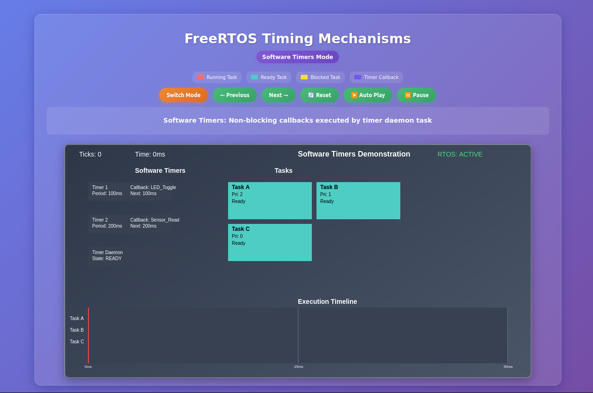

# Lesson 6: Software Timers in FreeRTOS

## 📚 Prerequisites

To follow this lesson, you should have:
- Basic knowledge of Arduino programming (e.g., `Serial.begin`, `pinMode`).
- Familiarity with FreeRTOS tasks and `vTaskDelay()` (covered in previous lessons).
- Understanding of `millis()` and `delay()` from Arduino programming.
- An ESP32 development board (e.g., ESP32 DevKitC) with GPIO 2 (LED) and GPIO 4 (touch pin T0).
- Arduino IDE with the ESP32 board package installed.

For setup instructions, visit: [ESP32 Arduino Setup Guide](https://docs.espressif.com/projects/arduino-esp32/en/latest/installing.html).

## ⏲️ Software Timers vs millis() vs Tasks with Delays vs delay()
When we think of timing in arduino projects, we often think of using `millis()` or `delay()`. However, in FreeRTOS, we have more sophisticated options like software timers. This lesson explores the differences between software timers, `millis()`, tasks with delays, and `delay()`, helping you choose the best timing method for your embedded systems.

### 📘 Definitions

#### ⏲️ Software Timers (in FreeRTOS)
- **Scheduled execution** of functions at specific times or intervals.
- **Non-blocking** - timers run in a dedicated FreeRTOS timer service task, separate from user tasks.
- **Callback-based** - execute a function when the timer expires.
- **One-shot** (triggers once) or **auto-reload** (triggers periodically) modes.
- **Efficient** for periodic or delayed actions without tying up tasks.

#### ⏱️ millis()
- **Time tracking** using the Arduino `millis()` function.
- **Non-blocking** - returns elapsed time since program start.
- **Manual checks** - requires code to compare timestamps for timing logic.
- **Simple** but prone to errors like overflow or complex state management.

#### 🛠️ Tasks with Delays (in FreeRTOS)
- **Blocking** - tasks pause execution with `vTaskDelay()`.
- **Direct control** - tasks manage their own timing, yielding to other tasks during delays.
- **Suitable** for sequential operations in a multi-tasking environment.
- **Less efficient** for multiple independent timers due to task overhead.

#### 💤 delay()
- **Blocking** - pauses the entire program using the Arduino `delay()` function.
- **Simple** - halts all execution for a specified duration.
- **Single-threaded** - no other code runs during the delay.
- **Inefficient** for multi-tasking or real-time systems, as it stops everything.

---

## ❓ When to Use Each?

| Feature                    | ⏲️ Software Timers        | ⏱️ millis()               | 🛠️ Tasks with Delays      | 💤 delay()                |
|----------------------------|---------------------------|---------------------------|---------------------------|---------------------------|
| Execution                  | Callback in timer service | Manual time checks       | Direct task code          | Entire program pause      |
| Blocking                   | Non-blocking              | Non-blocking             | Blocking (task only)      | Blocking (entire program) |
| Multiple timers            | Efficient (shared service)| Manual management        | Inefficient (multiple tasks)| Not viable                |
| Precision                  | Subject to service task   | High (if coded correctly)| Direct task control       | High but stops everything |
| Use case                   | Periodic actions, timeouts| Simple timing loops      | Sequential operations     | Simple, non-RTOS delays   |
| Resource usage             | Lower (shared resources)  | Minimal                  | Higher (per-task overhead)| Minimal but disruptive    |

---

## 🚀 Space Mission Control Analogy

Imagine a **space mission** where timing is critical for operations on a spacecraft:

---

### ⏲️ Software Timers — Mission Control Schedules
- **Mission control** sets automated schedules for tasks, like checking satellite signals every 10 minutes or initiating a system reboot after 5 hours.
- **Non-blocking** - the crew can focus on other tasks while the system automatically triggers these events.
- **Centralized** - a single control system manages multiple schedules, saving resources.
- **Reliable** - tasks fire precisely when planned, like clockwork, without crew intervention.

**Traits:**
- Automated, scheduled actions via callbacks.
- Non-blocking, runs in a timer service task.
- Efficient for multiple timed events.

---

### ⏱️ millis() — Astronaut Stopwatch Checks
- **Astronauts** use a stopwatch to track time and decide when to perform tasks, like checking oxygen levels every 5 minutes.
- **Non-blocking** - they keep working but must manually check the stopwatch and calculate intervals.
- **Manual effort** - prone to errors if they miscalculate or lose track of time.
- **Lightweight** - requires minimal equipment, just a simple timer.

**Traits:**
- Manual time tracking.
- Non-blocking but requires careful logic.
- Minimal resource use.

---

### 🛠️ Tasks with Delays — Manual Crew Pauses
- **Crew members** pause their work to wait for specific intervals, like stopping to monitor a sensor for 10 seconds before proceeding.
- **Blocking** - they can’t do other tasks during the wait, but other crew members (tasks) can continue.
- **Direct control** - the crew decides exactly when to resume.
- **Inefficient** for multiple tasks - each pause requires a dedicated crew member, increasing overhead.

**Traits:**
- Blocking execution for the task.
- Direct timing control, yields to other tasks.
- Higher resource usage for multiple waits.

---

### 💤 delay() — Astronaut Manual Equipment Resets
- **Astronauts** manually reset a piece of equipment, like rebooting a communication module, requiring all operations to stop for a fixed duration (e.g., 500 ms) to ensure the reset completes.
- **Blocking** - no other tasks can proceed during the reset, halting the entire mission temporarily.
- **Simple** - easy to execute but disrupts all spacecraft activities.
- **Inefficient** - unsuitable for multi-tasking, as it forces a complete pause.

**Traits:**
- Blocks the entire program.
- Simple but halts all operations.
- Not suitable for complex systems.

---

## 🌌 Real-World Applications

Choosing the right timing mechanism optimizes system design in embedded systems:

### ⏲️ Software Timers
- **Periodic Telemetry**: Sending sensor data (e.g., temperature, pressure) at regular intervals in a satellite system.
- **Timeouts**: Handling communication retries in IoT devices or waiting for user input in a control panel.
- **Scheduled Events**: Powering down non-critical systems after inactivity in a spacecraft.
- **Example in this Lesson**: The touch-controlled LED blinker (`06_Timer_Touch_LED.ino`) uses a timer to toggle an LED periodically, mimicking scheduled system checks.

### ⏱️ millis()
- **Simple Timing Loops**: Blinking status LEDs in a non-RTOS Arduino sketch for a drone’s indicator lights.
- **Button Debouncing**: Filtering noisy inputs in a user interface for a space rover’s control panel.
- **State Transitions**: Managing timed state changes in a simple payload experiment.
- **Example in Arduino**: Common in non-RTOS sketches for lightweight timing without `delay()`.

### 🛠️ Tasks with Delays
- **Sequential Operations**: Executing a startup sequence with pauses in a satellite’s deployment mechanism.
- **Synchronous Tasks**: Waiting for sensor stabilization in a space station’s data logger.
- **Debouncing Inputs**: Pausing to filter noisy signals, as seen in Lesson 2’s touch example.
- **Example in Previous Lessons**: Tasks using `vTaskDelay()` for pacing LED blinks in control systems.

### 💤 delay()
- **Basic Prototyping**: Creating simple LED blinking patterns in early Arduino sketches for quick testing.
- **Single-Threaded Demos**: Delaying actions in non-critical, single-task applications, like a basic sensor reader.
- **Learning Exercises**: Teaching timing concepts in beginner Arduino tutorials before introducing multi-tasking.
- **Limitations**: Avoid in FreeRTOS or real-time systems, as it disrupts all operations.

---

## Learning Objectives

By the end of this lesson, you will:

1. Understand the differences between software timers, `millis()`, tasks with delays, and `delay()`.
2. Learn to create and manage one-shot and auto-reload timers in FreeRTOS.
3. Implement timers for periodic and delayed actions.
4. Integrate timers with hardware inputs like the capacitive touch sensor.
5. Select the appropriate timing method for various embedded scenarios.

---

## 1. Software Timers: Scheduled Execution

Software timers schedule actions efficiently without blocking user tasks, running in a dedicated FreeRTOS timer service task. Below are a demo and a practical example.

### Demo Example: Timer Demo

The script `06_Timer_Demo.ino` showcases one-shot and auto-reload timers.

- **Creating Timers:**
  ```cpp
  autoReloadTimer = xTimerCreate("AutoReload", pdMS_TO_TICKS(2000), pdTRUE, NULL, autoReloadCallback);
  oneShotTimer = xTimerCreate("OneShot", pdMS_TO_TICKS(5000), pdFALSE, NULL, oneShotCallback);
  ```

- **Timer Callbacks:**
  - Auto-reload timer prints a message every 2 seconds.
  - One-shot timer prints a message once after 5 seconds.
  - Callbacks are lightweight and avoid blocking FreeRTOS API calls (e.g., no `vTaskDelay`).

**How It Works:**
- The auto-reload timer triggers every 2 seconds, logging a message to the Serial Monitor, simulating periodic system checks.
- The one-shot timer triggers once after 5 seconds, logging a distinct message, like a delayed system alert.
- Both run in the timer service task, leaving user tasks free for other operations.


### Practical Example: Touch-Controlled LED Blinking

In `06_Timer_Touch_LED.ino`, a timer blinks an LED every 500 ms, toggled by the touch sensor.

- **Creating the Timer:**
  ```cpp
  blinkTimer = xTimerCreate("BlinkTimer", pdMS_TO_TICKS(500), pdTRUE, NULL, blinkCallback);
  ```

- **Touch Task:**
  - Toggles the timer (start/stop) on touch using `xTimerStart` and `xTimerStop`.
  - Pinned to Core 0 for consistent performance on ESP32’s dual-core architecture.

**How It Works:**
- The touch task monitors GPIO 4 (T0). On touch (value < 40), it toggles the timer state, mimicking a crew member activating a scheduled task.
- The timer, when active, toggles the LED (GPIO 2) every 500 ms, like a status indicator on a spacecraft.
- Serial logs the timer state and touch events for debugging, resembling mission control logs.

**Note:** Calibrate the touch threshold (default: 40) by printing `touchRead(T0)` values if the sensor response is inconsistent. Values typically range from 10-80 depending on the ESP32 board.


---

## 2. millis(): Manual Time Tracking

The `millis()` function tracks elapsed time since program start, used in non-RTOS sketches.

### Example: Blinking LED with millis()

A loop blinks an LED using `millis()`.

- **Code:**
  ```cpp
  unsigned long lastToggle = 0;
  const long interval = 500;
  void loop() {
    unsigned long now = millis();
    if (now - lastToggle >= interval) {
      digitalWrite(LED_PIN, !digitalRead(LED_PIN));
      lastToggle = now;
    }
  }
  ```

**How It Works:**
- Tracks time with `millis()` to toggle the LED every 500 ms, like an astronaut checking a stopwatch.
- Non-blocking but requires manual state management, which can be complex for multiple timers.

**Limitations:**
- Complex for managing multiple independent timers.
- Risk of overflow after ~49 days (not critical for short tasks).

---

## 3. Tasks with Delays: Direct Control

Tasks with delays offer direct timing but block execution of the specific task, yielding to others.

### Example: Blinking LED with Task Delay

A task blinks an LED using `vTaskDelay()`.

- **Task Code:**
  ```cpp
  void blinkTask(void* p) {
    while (1) {
      digitalWrite(LED_PIN, HIGH);
      vTaskDelay(pdMS_TO_TICKS(500));
      digitalWrite(LED_PIN, LOW);
      vTaskDelay(pdMS_TO_TICKS(500));
    }
  }
  ```

**How It Works:**
- The task toggles the LED every 500 ms, like a crew member pausing to perform a check.
- Each `vTaskDelay` blocks the task, allowing other tasks to run, simulating a dedicated pause.

**Limitations:**
- Blocked tasks can’t multitask within themselves.
- Multiple delay-based tasks increase overhead.

---

## 4. delay(): Program-Wide Blocking

The `delay()` function pauses the entire program, halting all operations.

### Example: Blinking LED with delay()

A loop blinks an LED using `delay()`.

- **Code:**
  ```cpp
  void loop() {
    digitalWrite(LED_PIN, HIGH);
    delay(500);
    digitalWrite(LED_PIN, LOW);
    delay(500);
  }
  ```

**How It Works:**
- Toggles the LED every 500 ms, like an astronaut manually resetting equipment, stopping all other activities.
- Blocks the entire program, preventing any concurrent operations.

**Limitations:**
- Halts all execution, unsuitable for multi-tasking or real-time systems.
- Not recommended in FreeRTOS applications due to its disruptive nature.

---

## 5. Interactive Visualization

To deepen your understanding of the four timing methods, use the interactive visualization (`freertos_timing_visualization.html`) to see how each method affects task execution in a simulated environment.


### How to Use the Visualization
- **Open the Visualization**: Load `freertos_timing_visualization.html` in a web browser.
- **Switch Modes**: Click the "Switch Mode" button to cycle through Software Timers, `millis()`, `vTaskDelay()`, and `delay()`.
- **Navigate Steps**: Use "Previous" and "Next" buttons to step through the simulation manually, or click "Auto Play" to run it automatically (click "Pause" to stop).
- **Reset**: Click "Reset" to return to the initial state.
- **Canvas Display**:
  - **Tasks**: Shows three tasks (A, B, C) with states (Running: red, Ready: teal, Blocked: yellow, Suspended: gray).
  - **Timers**: For Software Timers mode, displays two timers and a timer daemon task executing callbacks (purple).
  - **Timeline**: Visualizes task execution and delays over time, with a red line indicating the current tick.
  - **System Info**: Displays the current mode, system ticks, and RTOS scheduler status (active or blocked).
- **Description Panel**: Explains each step (e.g., "Software Timers: Non-blocking callbacks executed by timer daemon task").

### What You’ll See
- **Software Timers**: Timers trigger callbacks in the timer daemon task, allowing tasks to run concurrently (non-blocking).
- **millis()**: Tasks check time non-blocking, remaining responsive while performing actions.
- **vTaskDelay()**: Tasks block during delays, but the RTOS scheduler allows other tasks to run.
- **delay()**: The entire CPU is blocked, suspending all tasks during the delay period.

This visualization illustrates the impact of each timing method on multi-tasking and efficiency, complementing the space mission analogy and code examples.

---

## 6. Best Practices and Guidelines

### Choosing the Right Timing Mechanism
- **Software Timers**: Ideal for non-blocking, periodic actions (e.g., `06_Timer_Touch_LED.ino`), like scheduled spacecraft checks.
- **millis()**: Best for simple, non-RTOS timing loops with minimal overhead, like astronaut manual checks.
- **Tasks with Delays**: Suitable for sequential, blocking operations in a multi-tasking environment, like crew pauses for specific tasks.
- **delay()**: Use only for simple, non-RTOS prototyping or single-threaded demos, not in FreeRTOS systems.

### Timer Configuration Tips
- Use reasonable periods (e.g., >100 ms) to avoid overloading the timer service task.
- Prefer auto-reload for repetitive tasks, one-shot for single events.
- Keep timer callbacks short and avoid blocking FreeRTOS APIs (e.g., `vTaskDelay`) to prevent system issues.

### Error Handling Best Practices
- Validate `xTimerCreate` success and halt on failure.
- Ensure timer start/stop operations are synchronized to avoid conflicts.
- Monitor Serial output for debugging timer states and touch events.
- Consider advanced timer functions like `xTimerReset` or `xTimerDelete` for dynamic control (explored in later lessons).

---

## Key Points Summary

### **Software Timers** ⏲️
- **Best for**: Scheduled, non-blocking actions.
- **Key advantage**: Efficient shared timer service task.
- **Use when**: Periodic or delayed tasks are needed.
- **Practical Example**: Touch-Controlled LED Blinking (`06_Timer_Touch_LED.ino`).
- **Real-World Use**: Telemetry polling, timeouts in space systems.

### **millis()** ⏱️
- **Best for**: Simple, non-blocking timing in non-RTOS sketches.
- **Key advantage**: Minimal resource use, easy to implement.
- **Use when**: Basic timing loops are sufficient.
- **Real-World Use**: Status indicators, button debouncing in simple systems.

### **Tasks with Delays** 🛠️
- **Best for**: Sequential, blocking operations in multi-tasking systems.
- **Key advantage**: Direct timing control, yields to other tasks.
- **Use when**: Simple delays or step-by-step execution is required.
- **Real-World Use**: Startup sequences, synchronous tasks in control systems.

### **delay()** 💤
- **Best for**: Basic, single-threaded prototyping.
- **Key advantage**: Extremely simple to use.
- **Use when**: Quick demos or non-critical, single-task applications.
- **Real-World Use**: Early Arduino sketches, non-RTOS testing.

### **Performance Hierarchy** (Most to Least Efficient for Multiple Timers)
1. 🥇 **Software Timers** - Shared service, non-blocking.
2. 🥈 **millis()** - Non-blocking but manual management.
3. 🥉 **Tasks with Delays** - Blocking, high overhead for multiple tasks.
4. 🥄 **delay()** - Blocks everything, highly inefficient.

**Note on Hardware and Multi-Core Usage:**
- Examples use GPIO 2 (LED) and GPIO 4 (T0) for touch sensing, consistent with Lesson 5.
- The touch task is pinned to Core 0 for consistent performance on ESP32’s dual-core architecture.
- Timers run in a FreeRTOS timer service task, separate from user tasks, ensuring non-blocking behavior.